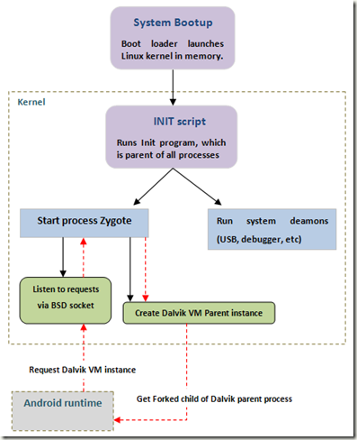
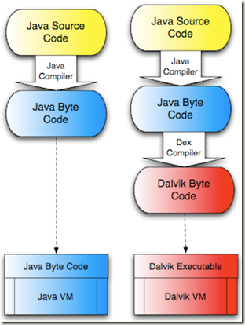

# 基于栈和寄存器的虚拟机架构对比，以及Dalvik虚拟机

虚拟机(VM)是本地操作系统上层更高的抽象，用于模拟物理机。这里，我们讲的是进程虚拟机，而不是系统虚拟机。虚拟机能让同一个平台运行在多种操作系统和硬件体系上。Java和Python的解释器可以作为一个例子，这些解释器中的代码是被编译成其虚拟机指定的字节码。微软的.Net体系也会为其CLR(Common Language Runtime)把源码编译成中间代码。

一个虚拟机一般要怎样实现呢？虚拟机需要模拟一个物理CPU执行的操作，所以，理想情况应该包含以下几个概念：

* 编译 - 把源代码编译成虚拟机指定的字节码
* 数据结构 - 包含指令和操作数（操作数是要被指令处理的数据）
* 调用栈 - 函数调用操作所需的调用栈
* 指令指针 - 指向下一个要执行的指令
* 虚拟CPU - 指令的处理器
    * 获取下一个指令（通过指令指针查找）
    * 解读操作数
    * 执行指令

基本上有两种主要的方法去实现虚拟机：基于栈，基于寄存器。基于栈的例子有Java虚拟机和.Net CLR，基于栈的方式是被最广泛使用的虚拟机实现方式。基于寄存器实现的虚拟机有Lua VM和Dalvik VM。这两种虚拟机实现方式使用了不同的机制来存储、获取操作数和它们的结果。

## 基于栈的虚拟机

基于栈的虚拟机大致实现了前文描述的一个虚拟机所需要的特性，但其存储操作数的内存结构是一个栈。虚拟机执行操作时先从栈中POP数据，处理完后再把结果PUSH回栈（LIFO - 后入先出）。在一个基于栈的虚拟机中，两个数相加的操作一般如下执行（20，7和27是操作数）：

    1. POP 20
    2. POP 7
    3. 20和7相加，得到结果
    4. PUSH 27

由于POP和PUSH操作，所以需要四条指令来执行相加操作。这种基于栈的模型有一个优势，栈指针隐式的定位了操作数（栈指针是上图中的SP）。这意味着虚拟机不必明确的知道操作数的地址了，因为通过栈指针就能得到下一个操作数。在基于栈的虚拟机中，所有的算术运算和逻辑运算都是通过在栈里POP、PUSH操作数和结果执行的。

## 基于寄存器的虚拟机

在基于寄存器实现的虚拟机中，存储操作数的数据结构基于CPU的寄存器。这里没有POP和PUSH操作，但是指令本身需要包含操作数的地址（寄存器）。这意味着，指令的操作数要在指令里明确定位，这和基于栈的模型中以一个栈针来定位操作数不同。例如，如果要在一个基于寄存器的虚拟机中执行相加操作，差不多会是下面这样的指令：

    1. ADD R1, R2, R3 ;        # 把R1和R2的值相加，结果存储在R3

就像我上面提到的，没有POP和PUSH操作，所以相加操作的指令只有一行。和栈不同，我们需要以R1，R2和R3来明确的告知操作数的地址。这种方式的优点是不用频繁的在一个栈中POP和PUSH数据，而且基于寄存器的虚拟机，其指令在指令调度循环里执行的更快。

另一个基于寄存器模型的优点正是基于栈模型无法做到的一些优化。比如这个实例，当代码中有子表达式时，寄存器模型可以只计算一次，把结果存到一个寄存器中，等到下次该子表达式再次出现时，可以直接用这个结果，减少了重复计算的花费。

基于寄存器模型的问题是寄存器指令比栈指令大，因为我们需要在寄存器的指令里明确的指明操作数的地址。栈的指令很短是因为用栈针操作来获取操作数，而寄存器的指令要包含操作数的访问，这同时也导致了比栈更大的寄存器编码。

我发现了一篇极好的文章([在这里](http://opensourceforu.com/2011/06/virtual-machines-for-abstraction-dalvik-vm/))，包括一个说明和一个简单的用C实现的基于寄存器的虚拟机。如果你的主要兴趣就是实现虚拟机和解释器，那也许用得上ANTLR之父Terrence Parr的书[‘Language Implementation Patterns: Create your own domain-specific and general programming languages’](http://wordpress.redirectingat.com/?id=725X1342&site=markfaction.wordpress.com&xs=1&isjs=1&url=http%3A%2F%2Fwww.amazon.com%2FLanguage-Implementation-Patterns-Domain-Specific-Programming%2Fdp%2F193435645X&xguid=bd620fc9a60280b5132692fa5fbd7ed9&xuuid=ddadb919e364bb1a8a4b3e5175e07033&xsessid=65d8839bae1ce505e450fd5197be6146&xcreo=0&xed=0&sref=https%3A%2F%2Fmarkfaction.wordpress.com%2F2012%2F07%2F15%2Fstack-based-vs-register-based-virtual-machine-architecture-and-the-dalvik-vm%2F&pref=https%3A%2F%2Fwww.google.com.hk%2F&xtz=-480)。

## DALVIK虚拟机

Dalvik虚拟机是Google为Android操作系统实现的，用于担任在Android设备上运行的java代码的解释器。它是一个进程虚拟机，因此下层的Android系统Linux内核会为每个进程生成一个Dalvik虚拟机实例。Android里的每个进程都有自己的Dalvik虚拟机实例。这减少了一个Dalvik虚拟机崩溃导致多个应用崩溃的机会。Dalvik实现了寄存器模型，而且和标准的Java字节码不一样，Dalvik用16位指令集，标准的Java栈虚拟机使用8位指令集。The registers are implemented in Dalvik as 4 bit fields.

如果要深入了解一点每个进程内部是如何获取一个Dalvik虚拟机实例的，我们就要去起始的地方...回到Android系统的Linux内核启动的地方：

在系统启动的时候，引导加载程序把内核加载到内存中，初始化系统参数。在这之后，

* 内核运行初始程序，它是系统里所有进程的父进程。
* 初始程序启动系统的守护进程和非常重要的‘Zygote’服务。
* Zygote进程创建一个Dalvik实例，它是系统中所有Dalvik虚拟机实例的父Dalvik进程。
* Zygote进程还会开启一个BSD读套接字，监听所有将要到来的请求。
* 当该套接字收到新的Dalvik虚拟机实例请求时，Zygote进程就会从父Dalvik虚拟机进程上fork一个子进程，并把子进程分派给发出请求的应用。

这就是本质上在Android系统中创建使用一个Dalvik虚拟机的方式。

回到虚拟机的话题上，Dalvik和Java虚拟机不同的是，它执行Dalvik字节码，而不是传统的Java字节码。Java编译器和Dalvik虚拟机中间有一步，把Java字节码转成Dalvik字节码，这一步是DEX编译器做的。下图描绘了JVM和Dalvik之间的不同([点这看图片源](http://ofps.oreilly.com/titles/9781449390501/The_Stack.html)):

DEX编译器把java的.class文件转成了更小且在Dalvik虚拟机上更优的.dex文件。

## 最后...

还没有明确的定论是基于栈的虚拟机更好还是基于寄存器的虚拟机更好。这仍然是一个被争论的话题，也是一个有趣的研究领域。[有一个有趣的研究论文](https://docs.google.com/viewer?a=v&q=cache:cPOTbgQfSF8J:www.usenix.org/events/vee05/full_papers/p153-yunhe.pdf+register+based+virtual+machine&hl=en&pid=bl&srcid=ADGEESiVdT4IVONxVrmGg4g1OTIuXjFx1mi-ZbxXetvlWMJBpbFyVh6Sc0iqIK2oRbYZdUmLXyCothUPSozS1J64ReJvvGapPGAzVDz-76IbYfDlwtsUcRN6Ddoia_nJL2udF9BnS2VF&sig=AHIEtbSuiwC8NheRf2cA9a4Jc99xvBr2Tw)，作者已经用寄存器模型重新实现了传统的JVM，并且得到了一些明显的性能收益。但愿我让读者明白了基于栈和寄存器的虚拟机之间的不同，并且也解释清了Dalvik虚拟机的一些细节。请尽管反馈或提问关于本文。

[原文链接](https://markfaction.wordpress.com/2012/07/15/stack-based-vs-register-based-virtual-machine-architecture-and-the-dalvik-vm/)