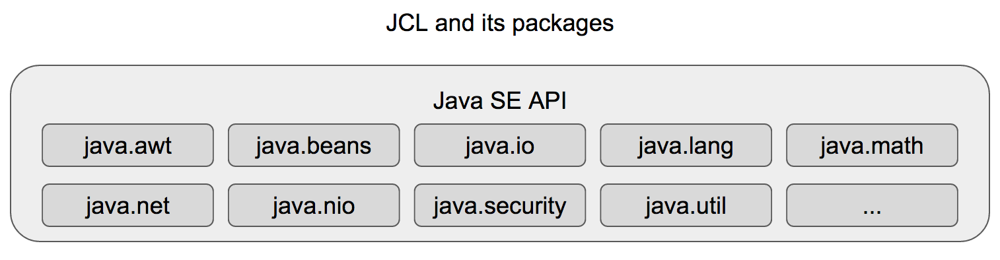

# Java平台和Java社区进程(JCP)概述

我要以本文向大家介绍Java平台最重要的部分，并就其Java平台进化的进程做一个简明解释。首先，我要介绍不同版Java之间的区别：Java ME，Java SE和Java EE，还有一些重要的，与它们有关的缩写，比如JDK，JRE，JVM，JSP，JPA等等。最后提供一个Java社区进程的概述。

## Java版本

在深入了解*Java社区进程*(JCP)之前，先了解一下Java平台的主要部分是非常重要的。Java被分成了三个不同的版本：Java标准版(Java SE)，Java企业版(Java EE)和Java微小版(Java ME)。

Java ME被创建用于支持[物联网](https://en.wikipedia.org/wiki/Internet_of_things)中的应用，它们运行在嵌入式设备或手机端设备上。到目前为止，这个版本远不如其兄弟版本那样受欢迎，本文不会把重点放在它上面，尽管也有很多缩写和进化进程和它有关。

Java标准版和企业版[被整个世界大量使用](http://www.tiobe.com/tiobe-index/)。它们一起被使用在很多解决方案上，比如[网站应用，应用的服务器，大数据技术等等](http://javarevisited.blogspot.com.br/2014/12/where-does-java-used-in-real-world.html)。

Java的每个版本都是由大量的模块组成的，这里不可能对整个平台提供一个全面的解释。所以，我简单的说明一下Java平台最重要的部分。

## Java标准版(Java SE)

Java标准版(Java SE)是运行Java程序的最小要求。这个版本为Java企业版提供了稳固的基础，所以，我要以说明它的组件作为开始：

* Java虚拟机(JVM)
* Java类库(JCL)
* Java运行时环境(JRE)
* Java开发工具集(JDK)

### Java虚拟机(JVM)

Java虚拟机(JVM)负责支持Java应用的运行。它是Java平台的组成部分，就是它实现了Java的**写一次，哪都可以运行**的目标。每个操作系统(Windows，Linux，Mac等)都需要有自己的JVM实现，否则就不能运行Java应用。

我们以一个从Java所在主机上读取文件的应用举个例子。如果这个应用不是运行在像*JVM*这样的引擎之上，那么一个类似*IO*操作的任务，就必须要给每种系统都写一份不同的程序。这将导致这个应用的发布进程变慢，而且很难在不同操作系统上去支持、分享这个应用。

要在脑子里记一个重要概念，JVM首先是一个规范(然后才是其它什么东西)。作为一个规范，不同的提供商就可以提供自己的JVM实现。[Wikipedia上有一篇保持更新的文章列出了开源和不开源的JVM](https://en.wikipedia.org/wiki/List_of_Java_virtual_machines)，最重要也最被广泛使用的JVM有：[Open JDK](http://openjdk.java.net/)(开源的)，[IBM的J9](https://www.ibm.com/support/knowledgecenter/SSYKE2_8.0.0/com.ibm.java.lnx.80.doc/user/java_jvm.html)和[Oracle JVM](http://www.oracle.com/technetwork/java/javase/downloads/index-jsp-138363.html)(后两个都不是开源的)。

*Java应用运行在基于特定操作系统和硬件架构实现的JVM之上*

### Java类库(JCL)

Java类库是一系列标准库的集合，对于任何运行在*JVM*上的应用都是可用的。库是由类组成的，这些库能让程序处理常见的任务，比如网络交互，集合控制，文件操作，用户界面创建等。这些标准库也叫做[Java标准版API](https://docs.oracle.com/javase/8/docs/api/)。

截止Java 8，*JVM*里可供应用使用的类超过了4000个。这导致Java的安装需要消耗[很大的硬盘空间](http://www.oracle.com/technetwork/java/javase/windows-diskspace-140460.html)。

Java成员意识到Java平台变得太大了，所以已经针对这个问题在Java 8上提了一个特性[compact profiles](http://www.oracle.com/technetwork/java/embedded/resources/tech/compact-profiles-overview-2157132.html)，并把整个Java 9的API都模块化了。

### Java运行时环境(JRE)

*Java运行时环境*(JRE)是一个工具集合，为Java应用提供了运行环境。每当用户要去运行一个Java程序时，就必须为供应方的环境架构(Linux x86，Linux x64，Mac OS X，Windows x64等等)选择一个可用的版本。

Java非常谨慎的保持着新版本对老版本的兼容性。因此，建议安装最新的可用版，新版可能会有更高的性能。

*JRE*安装后有两个值得注意的文件。第一个是`java`可执行文件，它负责引导*JVM*，*JVM*会负责运行应用。另一个是`rt.jar`文件，它包含了所有的构成了`JCL`的运行时类。

### Java开发工具集(JDK)

*Java开发工具集*(JDK)是*JRE*的扩展。除了*JRE*提供的文件和工具，*JDK*还包含用于创建Java程序的编译器和其它一些工具(比如JavaDoc和Java调试器)。因此，要开发Java应用就要安装*JDK*。

现今，JDK的绝大部分工具都不会被开发者直接使用了。通常，Java开发者是依赖第三方工具(比如[Apache Maven](https://maven.apache.org/)和[Gradle](https://gradle.org/))，来实现自动化编译、构建和分发的过程。开发者依赖IDE(集成开发环境)构建、调试他们的项目。

## Java企业版(Java EE)

*Java企业版*(Java EE)被创建用于扩展*Java SE*，它通过规范定义了一些被企业级应用普遍使用的功能。最新版[有超过40个规范](https://en.wikipedia.org/wiki/Java_EE_version_history#Java_EE_7_.28June_12.2C_2013.29)，帮助开发者创建[通过web service交互的应用](http://www.oracle.com/technetwork/java/javaee/tech/webservices-139501.html)，[把面向对象的数据转换成实体关系模型的应用](https://docs.oracle.com/javaee/7/tutorial/partpersist.htm)，[处理事务会话的应用](http://www.oracle.com/technetwork/java/javaee/jta/index.html)，[等等](http://www.oracle.com/technetwork/java/javaee/overview/index.html)。

企业版定义规范的最大优点在于，不同的提供商可以开发自己的应用服务器来支持Java EE。这就产生了更丰富的环境，企业可以选择最好的提供商来支持他们的业务。

### Java企业版的提供商

写作本文的时候有[8个合格的Java EE实现](https://en.wikipedia.org/wiki/Java_Platform,_Enterprise_Edition#Certified_application_servers)。这其中有两个免费开源的：[GlassFish服务器开源版](https://glassfish.java.net/)和[WildFly](http://wildfly.org/)。

*GlassFish*是Oracle开发的，*WildFly*是Red Hat开发的。他们还提供了这些应用服务器的私有收费版。Oracle提供了*Oracle GlassFish Server*，Red Hat提供了*JBoss企业应用平台*。

也许有人会奇怪为什么像Oracle和Red Hat这样的公司要提供两个版本的应用服务器：一个开源免费，另一个付费私有。这些版本之间最大的区别是，付费版通常有更高的性能和更好的支持。提供商花费了巨大的投资保证这些收费版运行地顺利，并且尽可能快的解决它们出现的问题。

### Java企业版的特性

上面说过，基于*JSR*，*Java EE*有超过40个特性。这些特性帮助公司处理持久化，安全，网络接口，状态验证等等普遍地需求。下面的列表列出了一些最重要和最被广泛使用的*Java EE*特性：

* **Java Persistence API (JPA)**：一个在Java对象和关系型数据库之间，用于访问，持久化和管理数据的规范。
* **JavaServer Faces (JSF)**：一个为网站应用构建基于组件的用户界面的规范。
* **JavaServer Pages (JSP)**：一个帮助开发者动态创建生成HTML网页的技术。
* **Java API for RESTful Web Services (JAX-RS)**：一个支持创建RESTful web service的规范。
* **Enterprise Java Beans (EJB)**：一个用于开发封装了应用业务逻辑组件的规范。
* **Context and Dependency Injection (CDI)**：一个允许开发者在Java中使用[反转控制](https://en.wikipedia.org/wiki/Inversion_of_control)的技术。

## Java社区进程(JCP)

*Java社区进程*(JCP)是一个确定并标准化Java技术的进程。JCP的成员，比如开发人员和公司，在这个进程里一起合作进化Java平台。任何对已经存在的Java技术的改进，或者新Java技术的引入，都是通过*Java规范请求*(JSR)来的。

作为一个例子，让我们来考虑一下RESTful Web Services的Java API规范(JAX-RS)被引入*Java EE*的过程。为了在*Java EE 5*中发布该规范，Sun公司发布了一个*JSR*到*JCP*程序中，[JSR311](https://jcp.org/en/jsr/detail?id=311#orig)。这个JSR定义的部分详情如下：

* 新规范的描述
* 新规范所在的平台
* 为什么需要这个新的规范
* 新规范所依赖的技术

这个规范请求被提交之后，*执行委员会*(EC)的成员分析决定这个请求是否值得注意。由于*执行委员会*批准了JSR311，所以Mark Hadley和Paul Sandoz(以前在Sun公司工作)被任命为*规范领导者*，并在*专家组*成员和*贡献者*们的帮助下继续工作。

就像上面这个例子，任何一个*JSR*的发布所需要的角色和工作流程都被定义在*JCP*程序中，并且由*执行委员会*治理。

### Java社区进程会员

如果要以官方的身份参与到一个*JSR*的阶段里或*JCP*进程里，一个组织或个人必须签订*Java规范参加协议*(JSPA)，一个*非正式会员协议*(AMA)或一个*伙伴会员协议*(PMA)。

任何签订了这些协议的实体(个人或组织)，会被分成三类*JCP会员*：非正式会员，伙伴会员和正式会员。这三种不同类型的资格会员在JCP进程扮演着不同的角色。

*JCP*提供了一个[非常详细的关于不同类型的实体(个人，非营利组织或商业组织)如何成为会员的解释](https://jcp.org/en/participation/overview)，以及[他们怎么贡献](https://jcp.org/aboutJava/communityprocess/final/jsr364/MembershipClasses_v7.pdf)。基本的规则如下：

* 非正式会员可以成为*JSR专家组*的贡献者；参加*JCP会员*活动；但在*执行委员会*的年度选举中，只能为两个非正式席位投票。
* 伙伴会员可以任职*执行委员会*；参加*JCP会员*活动；在*执行委员会*的年度选举中投票。
* 正式会员可以从事*执行委员会*的工作；在*执行委员会*的年度选举中投票；作为*JSR*的贡献者以及主持规范。

### 执行委员会(EC)

*执行委员会*(EC)扮演着*JCP*程序中最重要的角色。这个组的会员必须要分析，建议，投票和决定批准提交的*JSR*。而且还要负责指导整个平台的进化，*执行委员会*和整个*JCP*程序还要负责*JCP*程序本身，保证它是遵循程序和会员的社区期望的。

委员会的成员是通过[年度选举](https://jcp.org/en/participation/committee)选举出来的，他们的责任是：

* 检查，投票批准或拒绝新的*JSR*提议
* 检查，投票批准或拒绝公开审阅后的草案
* 决定*JSR*什么时候应该被撤回
* 合作修订*JCP*程序

### 规范领导者

*规范领导者*通常就是规范的作者，或者像*JAX-RS*规范一样是提交申请的组织的人。*规范领导者*的主要责任是领导*专家组*成员和*贡献者*开发规范，而且还要：

* 提供*JSR*的参考实现
* 完成*技术兼容工具*(TCK) - [一个测试套件用来测试*JSR*的正确性](https://jcp.org/en/resources/tdk)
* 更新[jcp.org](https://jcp.org/)上的页面，提供一些文档，比如[早期审阅草案](https://www.jcp.org/en/jsr/stage?listBy=community)，[公开审阅草案](https://www.jcp.org/en/jsr/stage?listBy=public)，[最终提议草案](https://www.jcp.org/en/jsr/stage?listBy=proposed)等等。

### 贡献者

*贡献者*是非正式会员(比如签订了*非正式会员协议*的个人)，帮助*专家组*和*规范领导者*测试开发一个*JSR*。这个角色是*JCP*程序里所有角色的第一步。在一个或多个*JSR*上做出过重大贡献的*贡献者*，有可能有很好的机会被考虑作为将来的*专家组*候选者或*规范领导者*。

### Java规范请求(JSR)

*Java规范请求*是一个启动改善Java平台的文档。一旦*JCP*程序的会员发现了改善Java平台的机会，就可以创建一个*JSR*来描述这个机会，提交修订它。之后这个*JSR*会经历一系列的阶段直到被发布或被抛弃。下面的列表列出了一个*JSR*从创建到发布的步骤：

* 编写*JSR*
* 提交*JSR*
* 审阅*JSR*
* 建立专家组
* 早期草案审阅
* 公开草案审阅
* 最终提议草案
* 最终投票表决

[JCP 2.10: 进程文档](https://jcp.org/en/procedures/jcp2#3.5.1)定义了所有这些阶段。但我下面还要做一个关于它们的总结：

### 编写Java规范请求

第一步是个人或公司发现了改善Java平台的机会，并写下它。这一步写出来的东西必须遵循*JSR*提交模版。

### 提交Java规范请求

作者遵循提交模版写完文档后，就可以提交给*JCP*程序了。如果与提交相关的所有事宜都是对的，那么这个*JSR*就进入了审阅阶段。

### 审阅Java规范请求

当一个*JSR*到达这个阶段后，执行委员会和整个社区有两到四周可以分析，并提出意见。

这个周期的时长是*JSR*提交者定义的。这个阶段会在一个*JSR批准投票*(JAB)中结束，执行委员会的成员有另外两周的时间投票。一个*JSR*被批准的条件是：

* 至少收到5个投票
* 收到的票中大多数是同意票(不计未投的票)

### 建立专家组

当执行委员会批准了一个*JSR*之后，*规范领导者*就可以建立为规范工作的*专家组*和*贡献者*团队了。当全体人员到齐后，他们就可以开始做*早期草案审阅*(EDR)了。

### 早期草案审阅

*早期草案审阅*的目标是把草稿版的协议尽快改成适合*公开审阅*的版本。这个阶段，公众的参与是必要且重要的，因为他们可以提出架构和技术上的问题，提升规范。

### 公开审阅

到达这个阶段说明已经很接近*JSR*的完整定义了，专家组已经准备好开始开发*参考实现*(RI)了。这个阶段的目标是最后收集一次反馈，在进入*最终提议草案*之前给社区一个机会，贡献最后一次。

### 最终提议草案

如果公开审阅成功了，*专家组*就可以针对提议做一些必要的修订，准备*最终提议草案*。*JSR*在这个阶段同时以一个规范和一个参考实现的形式结束的。另外，*规范领导者*和*专家组*要负责完成*TCK*。

### 最终投票表决

当所有的文档、实现和*TCK*都完成后，*规范领导者*发送规范的*最终草案*给*JCP*程序来初始化*最终批准投票*。假设，投票表决通过了，那最多14天后，这个规范和它的实现就会被发布到*JCP*的网站上。而这个*JSR*也进入了维护模式，以后只会有一些小的更新可能会出现。

## 结尾

如你所见，Java社区对首字母缩写有瘾，大部分缩写都包含字母*J*。但是伴随着这种"瘾"，Java社区构建了一个惊人的环境，通过一些明确的规则让Java可以作为一个平台，一个社区来演进。

这整个被定义为*JCP*的进程，使得依赖这些技术的公司可以遵循这些规范。遵循规范保证了公司可以有一个以上的提供商能支持他们的业务。这样，如果一个提供商开始提供不好的服务，甚至破产了，那就能保证公司在不用关心太多麻烦的情况下，就可以换另一个提供商。

当然，这个进程和这些规范不是免费来的。实际上，成本是非常高的，那就是被*JCP*社区采纳的新技术、新趋势所花费的时间。

让我们以一个公司想采用[GraphQL](http://graphql.org/)技术作为一个例子。现在没有任何一个Java版本支持这个技术，甚至有可能Java标准永远也不会支持它。所以如果这个公司真的想用它，就必须尝试去采纳一个和Java平台和规范没有任何关系的解决方案。这样一个公司就失去了规范的积极面。

那你呢，你对Java平台，*JCP*程序和整个Java社区有什么想法？你认为他们走的方向对吗？你想提些建议改变它吗？我们很乐意听到你的主意。

[原文链接](https://dzone.com/articles/java-platform-and-java-community-process-overview)