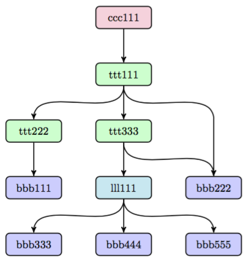

# IPFS - 基于内容寻址的，版本控制的，P2P文件系统(草稿3)
<div style="text-align:center;">Juan Benet</div>
<div style="text-align:center;">juan@benet.ai</div>

## 抽象

星际文件系统(IPFS)是一个P2P的分布式文件系统，它寻求用相同的文件系统把所有的电脑设备连接起来。在某些方面，IPFS和互联网很像，但它还能被看成是一个BitTorrent群，这个BitTorrent群里的节点用一个Git仓库交换对象。换句话说，IPFS提供了一个高吞吐量的，被内容寻址的块存储模型，和一个被内容寻址的超链接。这形成了一个Merkle DAG，在这种数据结构之上可以构建版本控制文件系统，区块链，甚至一个永存的网站。IPFS关联了一个分布式哈希表，一个激励式的数据块交换机制和一个能自我证明的命名空间。它没有单点失败问题，节点之间也不需要互相信任。

## 1.介绍

在构建一个全球分布式文件系统上，有过很多的尝试。有的系统获得了显著的成功，也有的完全失败了。在所有的学术上的尝试里，AFS[6]获得了巨大的成功，它现在仍被广泛的使用着，还没有其它系统达到过这种成功。而在学术之外，最成功的都是面向大媒体文件(音频和视频)的P2P文件共享应用系统。尤其是Napster, KaZaA和BitTorrent[2]这种能同时支撑超过上亿用户的大文件分发系统。甚至在今天，BitTorrent仍维护着一个每天上千万节点浮沉的部署规模[16]。这些系统碰到了远超同类学术系统的用户量和文件分发量。但是所有这些系统都没有被设计为其他系统的基础设施。虽然有过成功的再利用(注1)，但始终还是没能出现一个全球化的，低延迟的，无中心的文件系统。

这也许是因为已经有了一个在大多数情况下都“足够好”的存在：HTTP。至今为止，HTTP是被部署过的最成功的“文件的分布式系统”。加上浏览器，HTTP已经有了庞大的技术生态圈和社会影响力。如今它已成为事实上的因特网文件传输方式。但是，HTTP没能利用上过去十五年涌现出来的杰出的文件分发技术。从向后兼容所受约束的数量，和对现有模型投资的强大主体的数量上来说，进化互联网的基础设施几乎是不可能的。但是从另一个角度上来说，HTTP出现之后又出现了其他的协议，而这些新协议已经得到了广泛的应用。其实真正缺少的是对升级本身的设计：要如何在升级现有的HTTP网络，和引入新功能的同时，而不会降低用户的体验呢？

整个行业已经用了很长时间在HTTP上越走越远，因为用HTTP传输小文件相对来说是便宜的，而且就算一个小组织有着大量的文件传输工作，用HTTP也还算便宜。但是随着我们进入了数据分发的新纪元，要面临新的挑战了：(a)存储分发PB级别的数据，(b)跨组织进行大量数据的计算，(c)大容量、高清晰度的要求或实时的媒体流，(d)大规模数据集的版本化和链接，(e)防止重要文件的意外丢失，以及更多。其中许多都可以被总结为：“大量的数据，且在哪都要能访问”。受这些关键特性和宽带问题的影响，我们已经为不同的数据分发协议放弃了HTTP。下一步是怎么让这些协议成为互联网本身的一部分。

版本控制系统已经开发出重要的数据协作流程，这对高效的数据分发来说，正好是个对的切入角度。Git是一个分布式的源码版本控制系统，开发了许多有用的方法来建模和实现分布式数据操作。Git工具链提供了多种大型文件分发系统所缺乏的版本控制功能。受Git启发的新解决方案正在出现，比如Camlistore，它是一个个人文件存储系统；比如Dat，它是一个数据协作工具链和数据集包管理器。Git已经对分布式文件系统的设计产生了影响[9]，它的基于内容寻址的Merkle DAG数据模型带来了强大的文件分发策略。还有待探索的是，怎样用这种数据结构去影响以高吞吐量为目标的文件系统的设计，以及它该怎样升级互联网自身呢。

这篇论文介绍了IPFS，它是一个新颖的，旨在调和这些问题的P2P版本控制文件系统。IPFS综合了许多以前成功系统的优点，它谨慎地以接口为重点来集成这些优点，产生了远比把这些子部分直接相加的和更大的效果。IPFS的核心原则是把*所有数据*建模到同一个Merkle DAG中。

## 2.背景

这部分和大家回顾下IPFS关联的那些成功的P2P系统重要属性。

### 2.1 分布式哈希表

分布式哈希表(DHT)被广泛用于协调和维护P2P系统的元数据。比如，BitTorrent MainlineDHT被用于跟踪部分节点。

#### 2.1.1 Kademlia DHT

Kademlia[10]是一种比较流行的分布式哈希表，它提供了：

1. 在海量网络节点中高效查找：一次查询平均⌈<span style='font-size:16px'>log<span style='font-size:8px'>2</span>(n)</span>⌉个节点交互。(比如，在有一千万个节点的网络中只需要20个节点的交互)
2. 协调成本低：优化了发送给其他节点的控制消息的数量。
3. 以长时间存在的节点来抵御各种攻击。(一个网络中的节点，其已经连接的时间越长，在以后继续保持连接的可能性就越大。Kademlia选择这些长时间存活的节点来存储数据，能保证网络里有更多能提供有效服务的节点。)
4. 被诸如Gnutella和BitTorrent这些P2P应用广泛使用，形成了超过两千万个节点的网络[16]。

#### 2.1.2 Coral DSHT

虽然一些P2P文件系统直接把数据块存储在分布式哈希表里，但这是一种“对存储和带宽的浪费，因为数据必须还得存储在那些根本不需要它们的节点上”[5]。Coral DSHT在三个特别重要的方面扩展了Kademlia：

1. Kademlia把值存储到id“最近”(用XOR-distance算的)节点的键上。这没有考虑应用数据的位置，忽略了“远”节点也许已经有了这些数据的事实，强制“最近的”节点去存储这些数据，也不管这些节点是否需要这些数据。这浪费了大量的存储和带宽。而Coral会存储能提供这些数据的节点的地址。
2. Coral将分布式哈希表API的 **get_value(key)** 放宽到 **get_any_values(key)** (DSHT里的“sloppy” )。它仍然可以工作，这是因为Coral用户就只需要一个对等节点(工作中)就行了，而不是完整的对等节点列表。反过来，Coral可以只把值的子集分发给“最近的”节点，避免了热点问题(在一个键变的热起来时，让所有最近的节点都做好负载)。
3. 另外，Coral以DSHT群里的每个单独节点的区域和大小为依据，组织出了一个层次结构。这让节点们可以先查询它们区域里的对等节点，“查找附近的数据，而不是在很远的节点上查询”，极大的减少了查找的延迟。

#### 2.1.3 S/Kademlia DHT

S/Kademlia[1]在两个重要的方面扩展了Kademlia，以防止恶意的攻击：

1. S/Kademlia以scheme加固NodeId的生成，以此阻止Sybill攻击。它要求节点创建PKI密钥对，并以这个密钥对来获取节点的身份认证，以及签名发送出去的消息。一个scheme包含一个需要工作量证明来解决的加密难题，这使得Sybill的攻击成本昂贵。
2. S/Kademlia节点在不相交路径上查找值，以确保在网络上存在大量对手的情况下，忠实节点之间也能互相连接。S/Kademlia实现了85%的成功率，即使在敌对节点超过半数的情况下。

### 2.2 块交换 - BitTorrent

BitTorrent[3]是一个获得了广泛成功的P2P文件共享系统。它成功的协调了网络里不信任对等节点之间的合作，使他们互相之间完成了文件块的分发。BitTorrent和其生态系统的关键特性给IPFS带来了如下设计：

1. BitTorrent的数据交换协议使用了一个准tit-for-tat的策略：奖励互相贡献的节点，惩罚只拿取别人资源的节点。
2. BitTorrent的对等节点会跟踪可用的文件块，首先优先发送稀少的块。这使得种子传播者的负载减少了，非种子播种者的对等节点之间也可以互相交易。
3. BitTorrent的标准tit-for-tat策略对于一些可被利用的带宽共享策略来说，是脆弱的。PropShare[8]不同，它是一个对等节点带宽分配策略，可以更好的抵御带宽共享策略的问题，提高对等节点们的性能。

### 2.3 版本控制系统 - Git

版本控制系统提供了能对随着时间变化而产生的文件修改进行建模的设施，可以高效的分发不同的版本。流行的版本控制系统Git提供了一个强大的Merkle DAG(注2)对象模型，这个模型可以以分布式友好的方式捕获文件系统树的变化。

1. 不可变对象代表文件(blob)，目录(tree)和修改(commit)。
2. 对象是被内容寻址，通过内容的密码哈希。
3. 通过嵌入其他对象的链接，形成了一个Merkle DAG。这带来了许多有用的数据方面的完整性和工作流特性。
4. 大多数的版本元数据(分支，标签等)都是简单的指针引用，所以创建修改它们的花销很小。
5. 版本更改只是更新引用或添加新的对象。
6. 给其他用户分发版本的更改只是简单的传输对象和更新远程引用。

### 2.4 自我证明文件系统 - SFS

SFS[12,11]提出强制实现两个东西：(a)分布式信任链，(b)平等的共享全球命名空间。SFS引入了一种构建能自我证明的文件系统技术：使用下面的scheme寻址远程文件系统

/sfs/&lt;Location&gt;:&lt;HostID&gt;

Location是服务器的网络地址，而HostID为：

HostID = hash(public_key || Location)

就是根据上面的算法，SFS文件系统的一个*名称*就能证明自己的服务器。用户可以验证服务器提供的公钥，协商生成一个共享密钥，用它来加密所有和服务器的交互。所有的SFS实例共享一个全球命名空间，名称的分配是加密的，不是被一个中心机构把持的。

## 3. IPFS的设计

IPFS是一个分布式文件系统，它综合了前面那些P2P系统中成功的点子，包括分布式哈希表，BitTorrent，Git和SFS。IPFS的贡献是把这些成熟的技术简化、演进，并连接到一个内聚的系统中，这比把它们相加的和要大。IPFS是一个新的应用编写和部署平台，也是一个新的大块数据的分发、版本化系统。IPFS甚至可以演进互联网本身。

IPFS是P2P的；没有哪个节点有特权。IPFS节点将IPFS对象存储在本地存储中。节点之间彼此连接，互相传输对象。这些对象代表了文件以及其他一些数据结构。IPFS协议能被划分为负责不同功能的子协议栈：

1. **身份** - 管理节点的身份认证和验证。描述在3.1节。
2. **网络** - 管理与其他对等节点的连接，使用各种底层网络协议，可配置。描述在3.2节。
3. **路由** - 维护信息以定位特定的对等节点和对象。能响应本地和远程的查询请求。默认是一个分布式哈希表，可替换。描述在3.3节。
4. **交换** - 一种新的块交换协议(BitSwap)能支持有效块的分发。可模拟市场，弱化数据复制，交易策略可替换。描述在3.4节。
5. **对象** - 一个Merkle DAG，用链接基于内容寻址不可变对象。用于表示任意数据结构，比如，文件层次结构和通信系统。描述在3.5节。
6. **文件** - 受Git启发的一个版本化文件系统层级结构。描述在3.6节。
7. **命名** - 一个自我证明的可变名称系统。描述在3.7节。

这些子系统不是独立的；它们被集成到一起，互相利用对方的属性。但是把它们分开描述会更好，能自上而下的构建协议栈的概念。

注：下面的数据结构和函数是Go语言的。

### 3.1 身份

节点是由**NodeId**标识的，NodeId是节点公钥的密码哈希(注3)，用S/Kademlia的静态加密难题创建[1]。节点存储自己的公钥和私钥(用密码加密)。用户可以选择在每次启动时自由的设置一个“新”的节点身份(重新创建NodeId)，但是这样会损失以前积累的网络收益，所以并不鼓励改变节点的身份。

```
    type NodeId Multihash
    type Multihash []byte
    // 自描述的加密哈希摘要

    type PublicKey []byte
    type PrivateKey []byte
    // 自描述的密钥对

    type Node struct {
        NodeId NodeID
        PubKey PublicKey
        PriKey PrivateKey
    }
```

基于S/Kademlia的IPFS身份生成：

```
    difficulty = <integer parameter>
    n = Node{}
    do {
        n.PubKey, n.PrivKey = PKI.genKeyPair()
        n.NodeId = hash(n.PubKey)
        p = count_preceding_zero_bits(hash(n.NodeId))
    } while (p < difficulty)
```

首次连接时，对等节点之间交换公钥，并且会检查：**hash(other.PublicKey) 等于 other.NodeId**，如果不等于，则连接中断。

*密码函数的注意事项*

相比将系统锁定在一个指定的函数范围里做选择，IPFS更倾向于用一些能自我描述的值，这些自描述值能描述所使用的函数以及该函数计算出来的结果。**Multihash**被用来存储哈希摘要值、描述了所使用的哈希函数的短头部，以及哈希摘要字节的长度。比如：

```
    <函数的代号><摘要的长度><摘要的字节>
```

这就允许了系统：(a)为用例选择最好的函数(比如，更强的安全要求 vs 更快的性能要求)，(b)可以改进，因为函数的选择可以改变。自描述值允许系统之间在使用不同参数时也可以互相兼容。

### 3.2 网络

IPFS节点在网络上定期的和数百个其他节点交互，潜在地可能跨广域因特网。IPFS网络栈的特性：

* **传输**：IPFS能用任何传输协议，而且最适合用WebRTC的DataChannel(浏览器连接)或uTP(LEDBAT [14])。
* **可靠性**：IPFS能在底层网络不保证可靠性的情况下，用uTP(LEDBAT [14])或SCTP[15]保证可靠性。
* **连通性**：IPFS还使用ICE NAT打洞技术[13]。
* **完整性**：可选地，用**哈希校验和**来检查消息的完整性。
* **真实性**：可选地，用HMAC和消息发送者的公钥检验消息的真实性。

#### 3.2.1 对等节点寻址的注意事项

IPFS可以用任何网络；它不依赖IP，也不负责对IP的访问。这允许在覆盖网络中使用IPFS。IPFS以**multiaddr**格式的字节字符串存储地址，并把这些地址给底层网络用。**multiaddr**提供了表达地址和其协议的方式，支持封装。比如：

```
    # 一个SCTP/IPv4连接
    /ip4/10.20.30.40/sctp/1234/
    # 一个被TCP/IPv4代理的SCTP/IPv4连接
    /ip4/5.6.7.8/tcp/5678/ip4/1.2.3.4/sctp/1234/
```

### 3.3 路由

IPFS需要一个路由系统来发现：(a)其他对等节点的网络地址，(b)提供特定对象服务的对等节点。IPFS用了一个基于S/Kademlia和Coral的DSHT来实现这一点，用了一些在2.1节讨论过的属性。IPFS的对象大小和使用方式类似于Coral[5]和Mainline[16]，因此，IPFS的分布式哈希表以其所存储值的大小做了区分。大小比较小的值(小于等于1KB)直接存储在分布式哈希表里，而更大的值，只有其引用存在分布式哈希表里，引用就是提供对象服务的对等节点的**NodeId**。

DSHT的接口如下：

```
    type IPFSRouting interface {
        FindPeer(node NodeId)
        //获取一个特定对等节点的网络地址

        SetValue(key []bytes, value []bytes)
        // 把小的元数据值存到分布式哈希表里
        

        GetValue(key []bytes)
        // 从分布式哈希表里获取小元数据值
        

        ProvideValue(key Multihash)
        // 宣布这个节点可以服务很大的值
        

        FindValuePeers(key Multihash, min int)
        // 获取一些能提供大值的对等节点
    }
```

注：不同的场景会调用不同的路由系统(比如，在广域网用分布式哈希表，在局域网用静态哈希表)。因此，IPFS的路由系统可以替换为符合用户需求的路由系统。只要满足上面的接口，系统的其他部分就能继续运行。

### 3.4 块交换 - BitSwap协议

IPFS使用了一个受BitTorrent启发的协议：BitSwap，能在对等节点之间以块交换的形式分发数据。和BitTorrent像的是，BitSwap对等节点寻求获取的也是数据块(want_list)，同时自己也有一些数据块可用于交换(hava_list)。而和BitTorrent不像的是，BitSwap不会被限制到只能从一个torrent里获取数据块。BitSwap作为一个持续的市场，节点可以从市场里获取它们需要的数据块，无论这些数据块是哪个文件的一部分。这些块可能来自在文件系统中完全不相关的文件。节点们一起来到这个市场上进行交易。

交易系统这个概念暗示着可以创建一种虚拟货币，这要求要有一个全球化的账本来跟踪货币的所有权和流通。这可以被实现为BitSwap策略，以后在将来的论文里探讨这块。

在基本情况下，BitSwap节点之间必须以数据块的形式向对方提供直接的值。当数据块互补地分布在这些节点之间时，这样做很好，因为节点之间互相有对方要的东西。但通常并非如此，在某些情况下，一个节点必须为自己的数据块工作。这时候这种节点并没有其对等节点想要的数据块(甚至啥也没有)，所以它要去寻找它的对等节点需要的数据块，当然，这要比寻找它自己需要的数据块的优先级低。这就鼓励节点要缓存传播稀少的数据块，即使它们对这些数据块不是直接地感兴趣。

#### 3.4.1 BitSwap信用

在节点不需要什么特别的东西的时候，协议也必须激励节点传播数据，因为这些节点也许有其它节点需要的数据块。因此，BitSwap节点会乐观的给它的对等节点发送数据块，期望着对方会偿还债务。但是必须防止一些吸血节点(这种节点自由地加载数据，从不共享，一般下载完自己要的东西后就下线)，一个简单的类信用系统解决了这个问题：

1. 对等的节点们会跟踪其它节点的余额(用字节验证)。
2. 对等节点给欠债方发送数据块的概率会随着债务的增加而降低。

请注意，如果一个节点决定不给某个对等节点发送数据了，那在**ignore_cooldown**超时时间内，都会忽略这个对等节点。这能阻止请求发送者像掷骰子一样来获取更高的概率（BitSwap默认是10秒）

#### 3.4.2 BitSwap策略

不同的交换策略会对BitSwap对等节点的整体交换性能产生非常不同的影响。BitTorrent在指定一个标准策略时(tit-for-tat)，一些其他的策略也被实现了，从BitTyrant[8] (尽量不共享)到BitThief[8] (利用漏洞从不共享)，再到PropShare[8] (按比例共享)。BitSwap对等节点也可以类似地实现一系列的策略(好意的和恶意的)。那么选择一个策略的目的应该是：

1. 最大化节点的交易性能和整体交换性能
2. 防止通过开发交换机制的漏洞和降级交换机制而出现自由下载者
3. 能使用和抵抗其它未知的策略
4. 宽松的信任对等节点

在交换策略方向上的探索是未来的工作，实践里能选用的一个函数是sigmoid，以*债务比例*做运算：

假设*债务比例为r*，则一个节点和其对等节点之间的r为：

```
           bytes_sent
    r = ————————————————
         bytes_recv + 1
```

给定*r*值，则给欠债人发送数据块的概率为：

```
                               1
    P(send | r) = 1 - ——————————————————
                        1 + exp(6 - 3r)

```

从图1可以看出，r越大，P就越小。而且随着r的增加，P下降的很快，因为分母里的r的系数是3。


**图1: 当r增长时，发送的概率**

*债务比例*能衡量信用：对已经成功交换过大量数据的节点之间的债务宽容处理，而对未知不可信的节点进行无情处理。这能(a)抵抗每次都创建新节点而造成的攻击(sybill攻击)，(b)保护以前成功的交易关系，即使节点中的一个暂时无法提供有用的价值，(c)最终扼杀恶化的关系，直到它们改善。

#### 3.4.3 BitSwap账本

BitSwap节点维护一个账本，记录着和其它节点的传输。这让节点能跟踪历史记录，避免篡改。当激活一个连接后，BitSwap节点互相交换账本信息。如果账目不能正确的匹配，账本就会被重新初始化，重新从头开始，这样就损失了以前积累的信用和债务。恶意节点为了擦除债务，可能会故意的“丢失”账本。这导致正常的节点也不太可能累积足够的债务证明，也丢失了累积的信用。但其实正常的节点可以自由地将其视为不正当行为，从而拒绝交易。

```
    type Ledger struct {
        owner      NodeId
        partner    NodeId
        bytes_sent int
        bytes_recv int
        timestamp  Timestamp
    }
```

节点可以自由的选择是否保留账本历史记录，因为历史信息不是正确操作的必要条件。只有账本的当前条目是有用的。节点也可以根据需要自由的选择是否对账本做垃圾回收，先回收不太有用的记录：老记录(对等节点也许已经不存在了)和小记录。

#### 3.4.4 BitSwap规范

BitSwap节点遵循一个简单的协议。

```
    // 额外保留的状态
    type BitSwap struct {
        ledgers map[NodeId]Ledger
        // 该节点已知的帐目，不完整，无效

        active map[NodeId]Peer
        // 当前打开的和其它节点的连接

        need_list []Multihash
        // 这个节点需要的块的校验和

        have_list []Multihash
        // 这个节点拥有的块的校验和
    }

    type Peer struct {
        nodeid NodeId
        ledger Ledger
        // 这个对等节点和当前节点之间的账本

        last_seen Timestamp
        // 对等节点发来的最后一条消息的时间戳

        want_list []Multihash
        // 这个对等节点所需要的块的校验和，包含这个对等节点的对等节点所需要的块
    }

    // 协议接口:
    interface Peer {
        open (nodeid :NodeId, ledger :Ledger);
        send_want_list (want_list :WantList);
        send_block (block :Block) -> (complete :Bool);
        close (final :Bool);
    }
```

对等节点连接的生命周期简述：

1. 打开：对等节点之间互相发送**ledgers**，直到双方同意。
2. 发送：对等节点之间交换**want_list**和**block**。
3. 关闭：对等节点之间解除连接
4. 忽略：如果一个节点的策略要避免向某个对等节点发送数据，就会忽略这个对等节点(在策略生效期过期前)

***Peer.open(NodeId, Ledger).***

在进行连接时，一个节点用账本数据初始化连接，账本可能是从过去的连接上存储下来的，也可能是清零后的新账本。然后把账本数据用Open消息发送给对等节点。

当收到Open消息时，对等节点会选择是否要激活这个连接。如果 - 取决于接收节点的账本 - 发送方不是一个可信任的代理(传播的数据低于0，或者有大量未偿的债务)，接收方可能会忽略这次请求。这应该是受概率和**ignore_cooldown**超时时间来完成，以便既能纠正错误，也能打击攻击者。

如果激活了连接，接收方会用本地版本的账本来初始化一个Peer对象，并设置last_seen时间戳。然后拿自己的账本和收到的账本做比较，如果能正确的匹配，那连接就打开了。如果不能匹配，对等节点会创建一个新的清零的账本，然后发送。

***Peer.send_want_list(WantList).***

当连接打开后，节点就会向它连接上的所有对等节点发送want_list。发送want_list的时机有：(a)连接打开时，(b)被随机忽略定长时间超时后，(c)want_list变化后，(d)收到一个新块后。

当节点收到want_list时，会先存储它。然后，检查自己是否有被需要的块，有就发送，用上面的BitSwap策略。

***Peer.send_block(Block).***

数据块的发送是简单直接的，节点只是简单的传送块里的数据。当接收完所有数据后，接收方会计算Multihash里的校验和，以验证是否匹配，最后响应确认消息。

当正确完成了数据块的传输后，接收方会把它从need_list移到have_list里，然后接收方和发送方都更新它们的账本，记下传输的字节。

如果传输验证失败，有可能是发送方发生了故障，也有可能是它在攻击接收方。接收方可以选择拒绝进一步交易。请注意，BitSwap预期的是要在可靠的传输频道上进行操作的，所以应该把数据给BitSwap之前捕获传输的异常，传输失败可能会导致对忠诚的发送方进行错误的惩罚。

***Peer.close(Bool).***

关闭信号的最终参数有可能是发送方要关闭连接的意图，也有可能不是。如果不是，接收方可以选择立即重新打开连接，避免过早关闭。

一个对等节点的连接应该在两种情况下关闭：

* 在一个**silence_wait**超时时间内，没有从对等节点那收到任何消息(BitSwap默认使用30秒)，那么节点就会发出**Peer.close(false)**。
* 在节点退出时，关闭BitSwap。这时候节点会发出**Peer.close(true)**。

在**close**消息产生后，接收方和发送方都会关闭这个连接，清除存储的状态。可能会为将来存储账本数据，如果这么做有用的话。

注意：

* 一个未激活连接上的非Open消息应该被忽略掉。**send_block**消息的接收方可以检查数据块是否是自己需要的，正确的，如果是，这个块就可以用。无论如何，所有这些无序消息都会触发接收方产生**close(false)**消息，强制重新初始化连接。

### 3.5 对象Merkle DAG

分布式哈希表和BitSwap让IPFS形成了一个庞大的P2P系统，能快速强壮地存储分发数据。在这些之上，IPFS构建了一个Merkle DAG，它是一种有向无环图，IPFS对象里会包含对象之间的链接，这些链接是目标数据的密码哈希。Git的数据结构就是Merkle DAG。Merkle DAG为IPFS提供了许多有用的属性，包括：

1. **内容寻址**：所有内容都是由其多个哈希校验的和来做唯一标识的，包括链接。
2. **防篡改**：所有内容都是使用其校验和来验证的。如果数据被篡改或损坏了，IPFS能检测到该数据。
3. **去重**：内容完全相同的对象是相等的，只被存储一次。这对索引对象特别有用，比如git tree和git commit，或者公共部分的数据。

IPFS对象的格式是：

```
    type IPFSLink struct {
        Name string
        // 链接的名称或别名

        Hash Multihash
        // 目标的密码哈希

        Size int
        // 目标的总大小
    }

    type IPFSObject struct {
        links []IPFSLink
        // 链接的数组

        data []byte
        // 不透明的内容数据
    }
```

IPFS的Merkle DAG是一种非常灵活的数据存储方式。唯一要求的是：对象引用(a)以内容寻址生成的，(b)以上面的格式编码。IPFS授权上层应用完全的控制数据字段，上层应用可以选择使用任意自定义的数据格式，IPFS不需要理解这些数据格式。在对象里的链接表能让IPFS：

* 列出一个对象里所有对其它对象的引用，比如：

```
    > ipfs ls /XLZ1625Jjn7SubMDgEyeaynFuR84ginqvzb
    XLYkgq61DYaQ8NhkcqyU7rLcnSa7dSHQ16x 189458 less
    XLHBNmRQ5sJJrdMPuu48pzeyTtRo39tNDR5 19441 script
    XLF4hwVHsVuZ78FZK6fozf8Jj9WEURMbCX4 5286 template

    <object multihash> <object size> <link name>
```

* 解析查找路径字符串，比如foo/bar/baz。给定一个对象，IPFS把路径的第一个零件解析成该对象链接表里的一个哈希，然后根据这个哈希取来第二个对象，然后用路径的下个零件重复上面的操作。这样，无论什么数据格式，路径字符串都能遍历Merkle DAG了。
* 递归解析所有被引用的对象：

```
    > ipfs refs --recursive /XLZ1625Jjn7SubMDgEyeaynFuR84ginqvzb
        XLLxhdgJcXzLbtsLRL1twCHA2NrURp4H38s
        XLYkgq61DYaQ8NhkcqyU7rLcnSa7dSHQ16x
        XLHBNmRQ5sJJrdMPuu48pzeyTtRo39tNDR5
        XLWVQDqxo9Km9zLyquoC9gAP8CL1gWnHZ7z
        ...
```

一个原生的数据字段和一个通用的链接结构是在IPFS之上构造任意数据结构的必要组件。虽然很容易就能看出来Git的对象模型为何适合放在这个DAG上，但也请考虑下其它这些可能的数据结构：(a)键值对存储，(b)传统的关系型数据库，(c) Linked Data triple stores，(d) linked document publishing systems，(e)linked communications platforms，(f) 以密码学而建立的区块链。所有这些都可以建立在IPFS的Merkle DAG之上，所以允许任何这些系统使用IPFS作为更复杂应用的传输协议。

#### 3.5.1 路径

可以用一个字符串路径API在IPFS对象之间穿行。路径工作起来与传统的UNIX文件系统和互联网很像。Merkle DAG链接使对象之间的穿行很容易。注意IPFS全路径是如下形式：

```
    # 格式
    /ipfs/<hash-of-object>/<name-path-to-object>

    # 例子
    /ipfs/XLYkgq61DYaQ8NhkcqyU7rLcnSa7dSHQ16x/foo.txt
```

前缀/ipfs允许把IPFS无冲突的挂载到现有系统的标准挂载点上(挂载点名称当然是可配置的)。路径的第二个零件(IPFS下的第一个)是一个对象的哈希。一定是这样的，因为没有全局的根路径。根对象有一个不可能完成的任务，在分布式(可能是断开连接的)环境下维护数百万个对象的一致性。所以，我们使用内容寻址来模拟根路径，所有的对象都是通过它们的哈希来访问。注意，这意味着如果以路径<foo>/bar/baz给定3个对象，最后一个对象baz可以用下面的方式访问：

```
    /ipfs/foo的哈希/bar/baz
    /ipfs/bar的哈希/baz
    /ipfs/baz的哈希
```

#### 3.5.2 本地对象

IPFS客户端需要一些本地存储，一个外部系统为IPFS管理的对象负责，存储、检索着其本地原始数据。存储类型取决于节点的用法，大部分情况下是磁盘空间的一部分(可以是被本地文件系统管理的，也可以是一个键值存储系统，比如leveldb[4]，甚至是IPFS客户端直接管理)，也有一些其它情况，比如非持久化的缓存系统，这种存储用的是RAM的一部分。

最终IPFS里所有可用的块会成为某个节点本地存储的一部分。当用户请求获取对象时，这些对象能被找到，下载，最后存储到本地，最起码会临时存储到本地。这为以后提供了在一些可配置时间内的快速查找。

#### 3.5.3 对象的固定

节点要确保指定对象的存在，可以通过固定对象来做，这能确保把对象存储在节点的本地存储中。可以递归地固定对象，把链接指向的子孙对象也都固定下来，那么所有能被指到的对象也都被存在本地了。这对文件持久化(包括引用)来说是非常有用的。这也让IPFS成为了一个有永久链接的互联网，而且对象可以确保它指向的其它对象能够存活。

#### 3.5.4 发布对象

IPFS是全球分布式的。它被设计为能让数百万用户的文件共存在一起。分布式哈希表和以内容的哈希做寻址允许了公平的，安全的，完全分布式的对象发布。任何人都可以用如下方式发布对象：简单地把自己的密钥添加到分布式哈希表中，然后把自己添加为一个对等节点，最后把一个对象的路径给其它用户。请注意，对象本质上是不可变的，就像Git一样。新的版本哈希值会不同，因此是新的对象。版本跟踪是新加的新版本对象的工作。

#### 3.5.5 对象级别的密码系统

IPFS装配了对象级别的密码化操作。一个被加密后或签名后的对象被包装到了一个允许加密和验证的原始数据帧里。

```
    type EncryptedObject struct {
        Object []bytes
        // 加密后的原始对象数据

        Tag []bytes
        // 可选的加密组的标签
    }

    type SignedObject struct {
        Object []bytes
        // 签名后的原始对象数据

        Signature []bytes
        // hmac签名

        PublicKey []multihash
        // 多重哈希验证密钥
    }
```

加密操作改变了对象的哈希，定义了一个不同的对象。IPFS自动地验证签名，也可以用用户指定的密钥链解密数据。加密对象的链接也被保护起来了，所以没有解密密钥是不可能在加密对象上穿行的。可以用一个密钥加密父对象，用另一个密钥加密其子对象，或者根本不加密。这可以保护共享对象的链接。

### 3.6 文件

IPFS还在Merkle DAG上面定义了模拟版本控制文件系统的对象。这些对象模型和Git的很像：

1. block: 一块大小可变的数据
2. list: block的集合，或其它的list
3. tree: block，list的集合，或其它的tree
4. commit: 版本历史树上的一个快照

我曾经希望完全使用Git的对象格式，但这必定无法再引入某些分布式文件系统里有用的特性了，即(a)快速大小查找(字节大小已被聚合添加到对象里)，(b)大文件去重(添加一个列表对象)，(c)把提交也嵌入到树上。不过，IPFS文件的对象和Git的对象已经像到足够互相转换了。而且将Git对象引入到IPFS中，转换后不会丢失任何信息(比如unix文件权限等)。

注：下面的文件对象格式用的是JSON。但是请注意，虽然ipfs能导入/导出JSON数据，但实际上文件对象格式的结构，是使用protobuf做的二机制编码。

#### 3.6.1 文件对象：blob

Blob对象包含一个可寻址的数据单元，它代表着一个文件。IPFS的块和Git的blob或文件系统的数据块很像，存储着用户的数据。注意，IPFS的文件能同时用list和blob表示。Blob里没有链接。

```
    {
        "data": "some data here",
        // blobs have no links
    }
```

#### 3.6.2 文件对象：list

List对象代表着由几个IPFS blob对象串联在一起组成的大文件或去重文件。list里包含着一个blob对象或list对象的有序序列。在某种意义上，IPFS list的功能就像文件系统里不直接包含文件块的文件。由于list里还能包含list，所以能形成链表和平衡树的拓扑结构。同一个节点出现在多个位置的定向图能允许文件内部的去重。当然，环是不允许出现的，由哈希地址执行。

```
    {
        "data": ["blob", "list", "blob"],
        // list的data字段是对象类型的数组
        "links": [
            { "hash": "XLYkgq61DYaQ8NhkcqyU7rLcnSa7dSHQ16x", "size": 189458 },
            { "hash": "XLHBNmRQ5sJJrdMPuu48pzeyTtRo39tNDR5", "size": 19441 },
            { "hash": "XLWVQDqxo9Km9zLyquoC9gAP8CL1gWnHZ7z", "size": 5286 }
            // list里的链接没有名字
        ]
    }
```

#### 3.6.3 文件对象：tree

Tree对象在IPFS里和Git里类似：它代表目录，是名字到哈希的映射。哈希能引用blob，list，其它tree或commit。注意，传统路径命名已经用Merkle DAG实现。

```
    {
        "data": ["blob", "list", "blob"],
        // tree的data字段是对象类型的数组
        "links": [
            { "hash": "XLYkgq61DYaQ8NhkcqyU7rLcnSa7dSHQ16x", "name": "less", "size": 189458 },
            { "hash": "XLHBNmRQ5sJJrdMPuu48pzeyTtRo39tNDR5", "name": "script", "size": 19441 },
            { "hash": "XLWVQDqxo9Km9zLyquoC9gAP8CL1gWnHZ7z", "name": "template", "size": 5286 }
            // tree里的链接有名字
        ]
    }
```

#### 3.6.4 文件对象：commit

Commit对象在IPFS里代表任意对象历史版本里的一个快照。和Git的类似，但是能引用任意类型的对象。commit对象还会链接到作者对象。

```
    {
        "data": {
            "type": "tree",
            "date": "2014-09-20 12:44:06Z",
            "message": "This is a commit message."
        },
        "links": [
            { "hash": "XLa1qMBKiSEEDhojb9FFZ4tEvLf7FEQdhdU", "name": "parent", "size": 25309 },
            { "hash": "XLGw74KAy9junbh28x7ccWov9inu1Vo7pnX", "name": "object", "size": 5198 },
            { "hash": "XLF2ipQ4jD3UdeX5xp1KBgeHRhemUtaA8Vm", "name": "author", "size": 109 }
        ]
    }
```

#### 3.6.5 版本控制

commit对象代表一个对象历史版本里的特定快照。比较两个不同提交的对象能看到这两个版本的文件系统的差异之处。只要单一的一个提交和所有它引用的子对象是可访问的，那所有以前的版本就能被获取，整个文件系统的历史变化也都能被访问。这都发生在Merkle DAG对象模型上。

尽管Git和IPFS的对象模型并不一样，但它们是兼容的，所以Git版本控制工具的全部功能都可供IPFS用户使用。可以(a)构建一个能用IPFS对象图的Git工具的修改版，(b)构建一个可挂载的FUSE文件系统，能把IPFS的truee挂载成一个Git仓库，并把Git文件系统的读/写翻译成IPFS的格式。

#### 3.6.6 文件系统路径

如我们在Merkle DAG部分看到的，能用一个字符串路径API在IPFS对象之间穿行。IPFS文件对象被设计的能让IPFS更简单的挂载到一个UNIX文件系统上。这些对象的设计限制tree不能有数据，以便将tree表示为目录。并且提交可以被表示为目录，或者在文件系统里完全被隐藏起来。

#### 3.6.7 把文件拆分为List和Blob

版本化和分发大文件的一个主要挑战是，如何把大文件拆分割成独立的块。先不假设能为任何类型的文件都做出正确的决定，来看看IPFS提供的如下替代方案：

a. 像LBFS一样，用Rabin指纹算法挑选合适的块边界

b. 用rsync rolling-checksum算法检测版本之间变化的块

c. 允许用户指定块分割函数为特定文件进行高度调优

#### 3.6.8 路径查询性能

基于路径的访问要穿行对象图。获取一个对象需要先在分布式哈希表里查找这个对象的键，连接到对等节点，然后获取这个对象的块。这有相当大的开销，特别是在查找有很多子零件的路径时。减少开销的方法是：

* **缓存tree**：由于所有的对象都是以哈希定位的，所以这些对象可以永久的缓存。另外，tree的大小通常更小，所以IPFS优先缓存tree，而不是blob。
* **平铺tree**：对于任意给定的tree，都能构建出一个特殊的平铺的树，它列出了树上所有可达的对象。这个被铺平的树上的名称，将真的成为路径，原始树上的路径是这个路径的一部分，还有斜线。

 

**图2: 对象图样例**

```
    > ipfs file-cat <ccc111-hash> --json
    {
        "data": {
            "type": "tree",
            "date": "2014-09-20 12:44:06Z",
            "message": "This is a commit message."
        },
        "links": [
            { "hash": "<ccc000-hash>", "name": "parent", "size": 25309 },
            { "hash": "<ttt111-hash>", "name": "object", "size": 5198 },
            { "hash": "<aaa111-hash>", "name": "author", "size": 109 }
        ]
    }

    > ipfs file-cat <ttt111-hash> --json
    {
        "data": ["tree", "tree", "blob"],
        "links": [
            { "hash": "<ttt222-hash>", "name": "ttt222-name", "size": 1234 },
            { "hash": "<ttt333-hash>", "name": "ttt333-name", "size": 3456 },
            { "hash": "<bbb222-hash>", "name": "bbb222-name", "size": 22 }
        ]
    }

    > ipfs file-cat <bbb222-hash> --json
    {
        "data": "blob222 data",
        "links": []
    }
```

例如，把上面的ttt111的tree对象平铺：

```
    {
        "data": ["tree", "blob", "tree", "list", "blob" "blob"],
        "links": [
            { "hash": "<ttt222-hash>", "size": 1234, "name": "ttt222-name" },
            { "hash": "<bbb111-hash>", "size": 123, "name": "ttt222-name/bbb111-name" },
            { "hash": "<ttt333-hash>", "size": 3456, "name": "ttt333-name" },
            { "hash": "<lll111-hash>", "size": 587, "name": "ttt333-name/lll111-name"},
            { "hash": "<bbb222-hash>", "size": 22, "name": "ttt333-name/lll111-name/bbb222-name" },
            { "hash": "<bbb222-hash>", "size": 22, "name": "bbb222-name" }
        ]
    }
```

### 3.7 IPNS: 命名和可变状态

到目前为止，IPFS协议栈形成了一个P2P的块交换机制构造着对象的内容寻址的DAG。它服务着发布和检索不可变对象，甚至能跟踪这些对象的版本历史。然而，还缺少一个关键组件：可变命名。没有它，所有新内容的交流都得通过发送新内容的链接才能进行。所以，我们需要能用同一个路径获取可变的状态。

如果最终还是必须需要可变的数据，我们努力建立起一个不可变Merkle DAG的原因还是值得说下。考虑下IPFS建立在Merkle DAG上的属性：对象能(a)被通过它们的哈希获取，(b)被检查其完整性，(c)链接到其它对象，(d)永久的缓存。在某种意义上：

对象是**永久的**

这些是高性能分布式系统的关键属性，因为在分布式系统中跨网络链路移动数据是昂贵的。以对象内容寻址构造的网络能具有(a)显著的优化带宽，(b)不可信内容的服务，(c)永久化链接，(d)为任何对象和它引用的对象做全量永久化的备份。

不可变的以内容寻址的对象和命名组成了Merkle DAG，可变的指针指到这个Merkle DAG上，在很多成功的分布式系统中都有这对立的二者的出现。包络Git版本控制系统中的不可变对象和可变引用；Plan9是UNIX的分布式继任者，有着它的可变的Fossil文件系统和不可变的Venti文件系统；LBFS也有它的可变索引和不可变块。

#### 3.7.1 自我证明的名称

使用SFS[12, 11]的命名scheme，我们可以在一个密码化的，可分配的全球命名空间中，构造一种可自我证明的名称，这些名称是可变的。IPFS里的scheme如下：

1. 回想下IPFS里的: 
    
    NodeId = hash(node.PubKey)

2. 我们为每个用户分配了一个可变的命名空间: 

    /ipns/&lt;NodeId&gt;

3. 一个用户可以把一个对象发布到以其私钥**签名**的路径下，然后说在这呢：

    /ipns/XLF2ipQ4jD3UdeX5xp1KBgeHRhemUtaA8Vm/

4. 当其它用户获取这个对象时，可以检查其签名与对象发布者的公钥和NodeId是否匹配。这验证了用户发布对象的真实性，实现了可变状态的检索。

请注意下面的细节：

* ipns(星际命名空间)前缀是为程序和人类在*可变*和*不可变*路径上建立易辨识的不同。
* 由于这些名称*不*是基于内容寻址的对象，所以发布它们依赖于IPFS里唯一的可变状态分发系统：路由系统。这个过程是：(1)把这个对象发布成一个常规的不可变IPFS对象，(2)把它的哈希发布成路由系统元数据的值：

routing.setValue(NodeId, &lt;ns-object-hash&gt;)

* 对象发布后，其任何链接将作为命名空间的字名称：

```
    /ipns/XLF2ipQ4jD3UdeX5xp1KBgeHRhemUtaA8Vm/
    /ipns/XLF2ipQ4jD3UdeX5xp1KBgeHRhemUtaA8Vm/docs
    /ipns/XLF2ipQ4jD3UdeX5xp1KBgeHRhemUtaA8Vm/docs/ipfs
```

* 建议发布commit对象，或者其它一些有版本历史的对象，以便客户端能发现旧名称。不过这是留给用户的选项，因为不一定需要。

请注意，当用户发布此对象时，它不能被用相同的方式发布。

#### 3.7.2 人类友好的名称

虽然IPNS确实是一种分配和重新分配名称的方法，但它对用户来说并不友好，因为它把很长的哈希值公布为名称，总所周知，这非常难记。

这能为URL工作，但对很多种离线传输都不适合。因此，IPFS用下面的技术增加了IPNS的友好型。

***对等节点链接***

在SFS的促进下，用户可以把其它用户的对象直接链接到他们自己的对象里(命名空间，主页等)。这也有利于创建信任化的互联网(也支持老的CA模型)：

```
    # Alice以bob链接到Bob
    ipfs link /<alice-pk-hash>/friends/bob/<bob-pk-hash>

    # Eve链接到Alice
    ipfs link /<eve-pk-hash/friends/alice/<alice-pk-hash>

    # Eve也能访问Bob
    /<eve-pk-hash/friends/alice/friends/bob

    # 访问以签名来验证其合法性的域名
    /<verisign-pk-hash>/foo.com
```

***IPNS的DNS TXT记录***

如果/ipns/&lt;domain&gt;是有效的域名，IPFS会在它的DNS TXT记录里查询关键的ipns。IPFS会把查询到的值解释成一个对象的哈希，或者另一个IPNS路径：

```
    # DNS TXT记录
    ipfs.benet.ai. TXT "ipfs=XLF2ipQ4jD3U ..."

    # 表现为一个链接符号
    ln -s /ipns/XLF2ipQ4jD3U /ipns/fs.benet.ai
```

***Proquint 可读标识符***

总有些将二进制数据编码为可读单词的方案。IPNS支持Proquint，因此：

```
    # proquint的形式
    /ipns/dahih-dolij-sozuk-vosah-luvar-fuluh

    # 会被解析为
    /ipns/KhAwNprxYVxKqpDZ
```

***名称缩短服务***

提供名称缩短的服务必定会涌现，把他们的命名空间提供给用户。这就像我们今天看到的DNS和网络URL：

```
    # 用户可以获取一个链接
    /ipns/shorten.er/foobar

    # 链接到自己的命名空间
    /ipns/XLF2ipQ4jD3UdeX5xp1KBgeHRhemUtaA8Vm
```

### 3.8 使用IPFS

 IPFS被设计为能以多种不同的方式使用。这里只有一些我将会使用的用例：
 
 1. 作为一个可挂载的全球文件系统，挂载到/ipfs和/ipns。
 2. 作为一个可挂载的个人同步文件夹，这个文件夹能对任何写入自动的做版本控制，发布和备份。
 3. 作为一个文件加密和数据共享系统。
 4. 作为所有软件的版本化包管理器。
 5. 作为虚拟机的根文件系统。
 6. 作为虚拟机的启动文件系统(在hypervisor下)。
 7. 作为一个数据库：应用可以直接写入到Merkle DAG数据模型，获取IPFS提供的所有的版本，缓存和数据。
 8. 作为链接（和加密）通信平台。
 9. 作为大文件的可检查其完整性的内容分发网络(不用SSL)。
 10. 作为一个加密的内容分发网络。
 11. 用在网页上，作为互联网的内容分发网络。
 12. 作为一个新的，链接不会死亡的永久互联网。
 
 IPFS实现的目标：
 
 a. 一个能导入到你们应用里的IPFS库。
 
 b. 能直接维护对象的命令行工具。
 
 c. 可挂载的文件系统，使用FUSE或作为内核模块。
 
## 4.未来

IPFS背后的理念是数十年来学术界和开源界在分布式系统中成功研究的产物。IPFS综合了许多迄今最成功系统里的最优秀的想法。除了BitSwap这个新颖的协议，IPFS的主要贡献是系统的联合与设计的综合。

IPFS是一个雄心勃勃的新版无中心化互联网基础设置，在它上面可以建立许多不同类型的应用程序。最低限度，它可以用作全球的，可挂载的，版本化的文件系统和命名空间，或作为下一代的文件共享系统。而最佳情况是，它把互联网推向一个新的领域，在那里，发布有价值的信息不再托管在发布者那里，而是在感兴趣的用户那里；在那里，用户可以信任他们收到的内容，而不必再信任传送内容的节点；在那里，旧的但重要的文件不会再丢失。IPFS期待带大家走向永久互联网。

## 5.致谢

IPFS是许多伟大想法和系统的综合体。如果不是站在这些巨人的肩膀上，就不可能敢于有这样雄心勃勃的目标。个人为David Dalrymple，Joe Zimmerman和Ali Yahya长期的讨论许多这些想法表示感谢，特别是：揭示了Merkle DAG (David，Joe)，rolling hash blocking (David)和s/kademlia sybill protection (David，Ali)。并且特别感谢David Mazieres，因为他绝妙的想法。

## 6.参考

[1] I. Baumgart and S. Mies. S/kademlia: A practicable approach towards secure key-based routing. In *Parallel and Distributed Systems, 2007 International Conference on*, volume 2, pages 1–8. IEEE, 2007.

[2] I. BitTorrent. Bittorrent and Aˆ ̧ttorrent software surpass 150 million user milestone, Jan. 2012.

[3] B. Cohen. Incentives build robustness in bittorrent. In *Workshop on Economics of Peer-to-Peer systems*, volume 6, pages 68–72, 2003.

[4] J. Dean and S. Ghemawat. leveldb–a fast and lightweight key/value database library by google, 2011.

[5] M. J. Freedman, E. Freudenthal, and D. Mazieres. Democratizing content publication with coral. In *NSDI*, volume 4, pages 18–18, 2004.

[6] J. H. Howard, M. L. Kazar, S. G. Menees, D. A. Nichols, M. Satyanarayanan, R. N. Sidebotham, and M. J. West. Scale and performance in a distributed file system. ACM *Transactions on Computer Systems (TOCS)*, 6(1):51–81, 1988.

[7] J. Kubiatowicz, D. Bindel, Y. Chen, S. Czerwinski, P. Eaton, D. Geels, R. Gummadi, S. Rhea, H. Weatherspoon, W. Weimer, et al. Oceanstore: An architecture for global-scale persistent storage. *ACM Sigplan Notices*, 35(11):190–201, 2000.

[8] D. Levin, K. LaCurts, N. Spring, and
B. Bhattacharjee. Bittorrent is an auction: analyzing and improving bittorrent’s incentives. In *ACM SIGCOMM Computer Communication Review*, volume 38, pages 243–254. ACM, 2008.

[9] A. J. Mashtizadeh, A. Bittau, Y. F. Huang, and D. Mazieres. Replication, history, and grafting in the ori file system. In *Proceedings of the Twenty-Fourth ACM Symposium on Operating Systems Principles*, pages 151–166. ACM, 2013.

[10] P. Maymounkov and D. Mazieres. Kademlia: A peer-to-peer information system based on the xor metric. In *Peer-to-Peer Systems*, pages 53–65. Springer, 2002.

[11] D. Mazieres and F. Kaashoek. Self-certifying file system. 2000.

[12] D. Mazieres and M. F. Kaashoek. Escaping the evils of centralized control with self-certifying pathnames. In *Proceedings of the 8th ACM SIGOPS European workshop on Support for composing distributed applications*, pages 118–125. ACM, 1998.

[13] J. Rosenberg and A. Keranen. Interactive connectivity establishment (ice): A protocol for network address translator (nat) traversal for offer/answer protocols. 2013.

[14] S. Shalunov, G. Hazel, J. Iyengar, and M. Kuehlewind. Low extra delay background transport (ledbat). *draft-ietf-ledbat-congestion-04. txt*, 2010.

[15] R. R. Stewart and Q. Xie. *Stream control transmission protocol (SCTP): a reference guide*. Addison-Wesley Longman Publishing Co., Inc., 2001.

[16] L. Wang and J. Kangasharju. Measuring large-scale distributed systems: case of bittorrent mainline dht. In *Peer-to-Peer Computing (P2P), 2013 IEEE Thirteenth International Conference on*, pages 1–10. IEEE, 2013.

***

**注**

1. 例如，Linux发行版使用BitTorrent来传输磁盘镜像，暴雪公司使用它来发布视频游戏内容。
2. 梅克尔有向无环图 - 和梅克尔树很像，但是一个更一般化的结构，可去重，不需要平衡，非叶子节点包含数据。
3. 在本文档中，*哈希*与*校验和*具体指的是数据的密码哈希校验和。

[原文链接](https://github.com/ipfs/papers/blob/master/ipfs-cap2pfs/ipfs-p2p-file-system.pdf)
