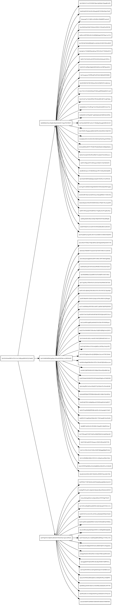

# 图像化对象


当用IPFS存储文件或写更复杂的数据结构时，把被创建出来的merkledag可视化通常是非常有用的。为此我写了一个简单的工具叫做`graphmd`(graph merkle dag)。

`graphmd`是一个非常短的shell脚本([源码](./graphmd))。它使用了`ipfs refs --format`标志生成`dot`输出。

## 安装graphmd

`graphmd`很快就将处于它自己的仓库中，但是现在只能通过下面的方式：

```
ipfs cat Qmcd7Sebd46vxDWjbUERK8w82zp8sgWTtHT5c93kzr2v3M  >/usr/local/bin/graphmd
chmod +x /usr/local/bin/graphmd
```

## graphmd用法

```
> graphmd
usage: graphmd <ipfs-path>...
output merkledag links in graphviz dot

use it with dot:
  bin/graphmd QmZPAMWUfLD95GsdorXt9hH7aVrarb2SuLDMVVe6gABYmx | dot -Tsvg
  bin/graphmd QmZPAMWUfLD95GsdorXt9hH7aVrarb2SuLDMVVe6gABYmx | dot -Tpng
  bin/graphmd QmZPAMWUfLD95GsdorXt9hH7aVrarb2SuLDMVVe6gABYmx | dot -Tpdf
```

## 例子

[demo](https://ipfs.io/ipfs/QmRCJXG7HSmprrYwDrK1GctXHgbV7EYpVcJPQPwevoQuqF)目录:

```sh
> tree demo
demo
├── cat.jpg
└── test
    ├── bar
    ├── baz
    │   ├── b
    │   └── f
    └── foo

2个目录，5个文件
```

把这些文件添加到IPFS

```sh
> ipfs add -r demo
added QmajFHHivh25Qb2cNbnnnEeUe1gDLHX9ta7hs2XKX1vazb demo/cat.jpg
added QmTz3oc4gdpRMKP2sdGUPZTAGRngqjsi99BPoztyP53JMM demo/test/bar
added QmTz3oc4gdpRMKP2sdGUPZTAGRngqjsi99BPoztyP53JMM demo/test/baz/b
added QmYNmQKp6SuaVrpgWRsPTgCQCnpxUYGq76YEKBXuj2N4H6 demo/test/baz/f
added QmX1ebVUtfY11ZCpVmqyE5mDoN62SpLd8eLPpg5GGV1ABt demo/test/baz
added QmYNmQKp6SuaVrpgWRsPTgCQCnpxUYGq76YEKBXuj2N4H6 demo/test/foo
added QmNtpA5TBNqHrKf3cLQ1AiUKXiE4JmUodbG5gXrajg8wdv demo/test
added QmRCJXG7HSmprrYwDrK1GctXHgbV7EYpVcJPQPwevoQuqF demo
```

使用`graphmd`生成dot输出

```sh
> graphmd QmRCJXG7HSmprrYwDrK1GctXHgbV7EYpVcJPQPwevoQuqF >graph.dot
digraph {
  graph [rankdir=LR];
  QmRCJXG7HSmprrYwDrK1GctXHgbV7EYpVcJPQPwevoQuqF [fontsize=8 shape=box];
  QmajFHHivh25Qb2cNbnnnEeUe1gDLHX9ta7hs2XKX1vazb [fontsize=8 shape=box];
  QmRCJXG7HSmprrYwDrK1GctXHgbV7EYpVcJPQPwevoQuqF -> QmajFHHivh25Qb2cNbnnnEeUe1gDLHX9ta7hs2XKX1vazb [label="cat.jpg"];
  QmRCJXG7HSmprrYwDrK1GctXHgbV7EYpVcJPQPwevoQuqF [fontsize=8 shape=box];
  QmNtpA5TBNqHrKf3cLQ1AiUKXiE4JmUodbG5gXrajg8wdv [fontsize=8 shape=box];
  QmRCJXG7HSmprrYwDrK1GctXHgbV7EYpVcJPQPwevoQuqF -> QmNtpA5TBNqHrKf3cLQ1AiUKXiE4JmUodbG5gXrajg8wdv [label="test"];
  QmNtpA5TBNqHrKf3cLQ1AiUKXiE4JmUodbG5gXrajg8wdv [fontsize=8 shape=box];
  QmTz3oc4gdpRMKP2sdGUPZTAGRngqjsi99BPoztyP53JMM [fontsize=8 shape=box];
  QmNtpA5TBNqHrKf3cLQ1AiUKXiE4JmUodbG5gXrajg8wdv -> QmTz3oc4gdpRMKP2sdGUPZTAGRngqjsi99BPoztyP53JMM [label="bar"];
  QmNtpA5TBNqHrKf3cLQ1AiUKXiE4JmUodbG5gXrajg8wdv [fontsize=8 shape=box];
  QmX1ebVUtfY11ZCpVmqyE5mDoN62SpLd8eLPpg5GGV1ABt [fontsize=8 shape=box];
  QmNtpA5TBNqHrKf3cLQ1AiUKXiE4JmUodbG5gXrajg8wdv -> QmX1ebVUtfY11ZCpVmqyE5mDoN62SpLd8eLPpg5GGV1ABt [label="baz"];
  QmX1ebVUtfY11ZCpVmqyE5mDoN62SpLd8eLPpg5GGV1ABt [fontsize=8 shape=box];
  QmTz3oc4gdpRMKP2sdGUPZTAGRngqjsi99BPoztyP53JMM [fontsize=8 shape=box];
  QmX1ebVUtfY11ZCpVmqyE5mDoN62SpLd8eLPpg5GGV1ABt -> QmTz3oc4gdpRMKP2sdGUPZTAGRngqjsi99BPoztyP53JMM [label="b"];
  QmX1ebVUtfY11ZCpVmqyE5mDoN62SpLd8eLPpg5GGV1ABt [fontsize=8 shape=box];
  QmYNmQKp6SuaVrpgWRsPTgCQCnpxUYGq76YEKBXuj2N4H6 [fontsize=8 shape=box];
  QmX1ebVUtfY11ZCpVmqyE5mDoN62SpLd8eLPpg5GGV1ABt -> QmYNmQKp6SuaVrpgWRsPTgCQCnpxUYGq76YEKBXuj2N4H6 [label="f"];
  QmNtpA5TBNqHrKf3cLQ1AiUKXiE4JmUodbG5gXrajg8wdv [fontsize=8 shape=box];
  QmYNmQKp6SuaVrpgWRsPTgCQCnpxUYGq76YEKBXuj2N4H6 [fontsize=8 shape=box];
  QmNtpA5TBNqHrKf3cLQ1AiUKXiE4JmUodbG5gXrajg8wdv -> QmYNmQKp6SuaVrpgWRsPTgCQCnpxUYGq76YEKBXuj2N4H6 [label="foo"];
}
```

以管道操作把上面的输出给`dot`以生成`svg`，`pdf`，`png`或[其它的啥](http://www.graphviz.org/Documentation/dotguide.pdf)

```
graphmd QmRCJXG7HSmprrYwDrK1GctXHgbV7EYpVcJPQPwevoQuqF | dot -Tsvg >output/graph.svg
graphmd QmRCJXG7HSmprrYwDrK1GctXHgbV7EYpVcJPQPwevoQuqF | dot -Tpdf >output/graph.pdf
graphmd QmRCJXG7HSmprrYwDrK1GctXHgbV7EYpVcJPQPwevoQuqF | dot -Tpng >output/graph.png
```

Et voilà：[svg](https://ipfs.io/ipfs/QmbefthRKDReojALJi8nGPwvUVPqe1aXdoD9ysX44aUfvG/graph.svg)，[pdf](https://ipfs.io/ipfs/QmbefthRKDReojALJi8nGPwvUVPqe1aXdoD9ysX44aUfvG/graph.pdf)，[png](https://ipfs.io/ipfs/QmbefthRKDReojALJi8nGPwvUVPqe1aXdoD9ysX44aUfvG/graph.png)


## 文件块

`graphmd`在查看文件分块算法上特别好用。比如下面是默认semi-balanced间接分块算法形成的`ipfs`二进制块：

- [dot输出](https://ipfs.io/ipfs/QmQ8yWC1SGn73P1SPSw8iqSBGEscve1N6sQpzd1xzD5EV1/graph.dot)
- [svg渲染](https://ipfs.io/ipfs/QmQ8yWC1SGn73P1SPSw8iqSBGEscve1N6sQpzd1xzD5EV1/graph.svg)
- [pdf渲染](https://ipfs.io/ipfs/QmQ8yWC1SGn73P1SPSw8iqSBGEscve1N6sQpzd1xzD5EV1/graph.pdf)



by [Juan Benet](https://github.com/jbenet)

[原文链接](https://ipfs.io/ipfs/QmNZiPk974vDsPmQii3YbrMKfi12KTSNM7XMiYyiea4VYZ/example#/ipfs/QmRFTtbyEp3UaT67ByYW299Suw7HKKnWK6NJMdNFzDjYdX/graphmd/README.md)