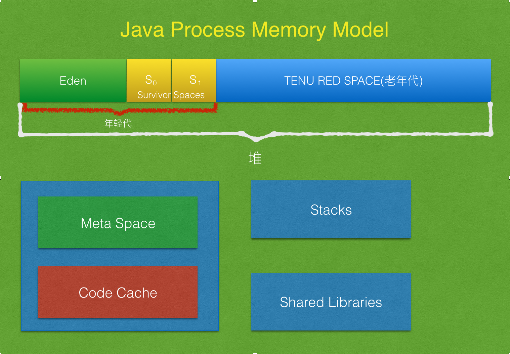

# 理解Java内存模型和垃圾回收

本文会尝试带领大家理解Java内存模型和垃圾回收的工作机制。本文用的是JDK8 Oracle Hot Spot 64 bit JVM。首先，请允许我来描绘Java进程可用的不同内存区域。

JVM运行起来时，操作系统会为其分配内存。这里，JVM这个名词是指一个JVM进程，分配给这个进程的内存包括堆，元空间，JIT代码缓存，线程栈和共享库。我们称这些内存为本地内存。“本地内存”是操作系统提供给进程的内存。有多少内存被分配给Java进程取决于操作系统，处理器和JRE。让我解释一下JVM可用的各个内存块：

堆内存：JVM使用这块内存存储对象。它被拆分成两块：“年轻代空间”和“老年代空间”。

年轻代：年轻代被划成了两部分：“伊甸园空间”和“幸存者空间”

伊甸园空间：当我们创建一个对象时，就是从伊甸园空间分配的内存。

幸存者空间：这里面包含了从minor GC幸存的对象。幸存者空间被划分成两块一样大的空间，S0和S1。

老年代：对象经历的minor GC次数达到了一个阈值后(max tenuring threshold)，就会被移到老年代。

当我们讨论垃圾回收的过程时，我们需要知道上面的内存位置都是怎样被使用的。

元空间：这块内存在堆内存之外，但也是本地内存的一部分。按照Oracle文档上写的，默认情况下元空间是没有上限的。在Java 8之前这块空间被叫做“永久代”。它被用于存储通过classloader加载的类定义信息。为了避免内存溢出错误，元空间被设计成可增长的。但是，如果它长的比可用物理内存还大，操作系统就会使用虚拟内存了。这将导致程序的性能下能，因为把数据从虚拟内存交换到物理内存，或者反过来交换，都是非常昂贵的操作。有一个JVM选项用来限制JVM使用的元空间大小，在这种情况下可能会收到内存溢出错误。

JIT代码缓存：JVM有一个字节码的解释器，把字节码转换成具体硬件的机器码。即时(JIT)编译器作为JVM优化的一部分被引入，经常被访问的代码块会被其编译成本地代码并存储在代码缓存里。被编译后的代码就不会再被解释了。

现在让我们来讨论垃圾回收的过程。JVM使用一个分开的守护线程做垃圾回收。JVM会做minor GC和major GC。先来看minor GC。

起初，幸存者空间和老年代空间都是空的。上面讲过，当应用程序创建一个对象时，JVM会试图从伊甸园空间获取需要的内存。当JVM不能从伊甸园空间获取到内存时，它就会开始minor GC。在minor GC期间，不可达的对象被标记为待回收。JVM选择一个幸存者空间作为“to space”，也许是S0，也许是S1。让我们假设JVM选择S0作为“to space”。JVM把可达的对象拷贝到S0中，并把这些对象的年龄加1。如果幸存者空间放不下这么多对象，有一部分就被移到老年代去了，这个过程叫做“提前晋升”。幸存者空间的大小是不会增长的。

在第二次minor GC时，垃圾回收器会把伊甸园空间和S0中的可达对象拷贝到S1，这时候S1就成为“to space”了。每次minor GC都会把可达对象的年龄加1。

当年轻代中的对象达到最大年龄阈值时，它们就会被拷贝到老年代了。JVM选项“MaxTenuringThreshold”可用于指定对象晋升到老年代的年龄阈值，其默认值是15。

所以minor GC是用于回收年轻代空间的，它是一个“stop the world”的过程。有时候程序暂停的时间是可以忽略不计的。minor GC可以单线程的执行也可以多线程的执行，这取决于垃圾回收器。

minor GC触发很多次后，老年代最终就会被填满，这就需要更多的垃圾回收了。这时候JVM会触发“major GC”，有时候我们把这个过程称作“full GC”，但是从“元空间”回收内存也是“full GC”的一部分。如果堆里没有空间了，那加载过的类会被从元空间中删掉。

现在让我们看看什么情况会让JVM触发major GC：

* 开发者调用`System.gc()`或`Runtime.getRunTime().gc()`会建议JVM开始GC。
* JVM判定老年代没有足够的空间了。
* minor GC期间，如果JVM不能从伊甸园和幸存者空间回收足够的内存，就会触发major GC。
* 如果我们设置了“MaxMetaspaceSize”，而且没有足够的空间加载新类了，JVM就会触发major GC。

[原文链接](https://dzone.com/articles/understanding-the-java-memory-model-and-the-garbag)
